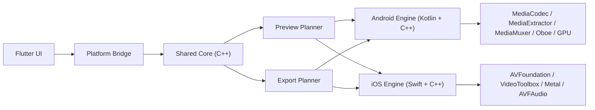

# FusionX Engine Architecture

Status: Proposed
Date: March 30, 2026
Scope: UI-only Flutter shell + native editing engine rebuild

## Goal

Build a professional mobile video editor with:

- Flutter for UI only
- shared engine contracts and timeline authority
- Android native engine first
- iOS native engine second
- low-latency preview and audio
- independent export pipeline
- strong separation between UI, engine state, decoding, rendering, and export

This document defines the architecture we should commit to before building the real engine.

## Core Decisions

1. Flutter is not the media engine.
2. Timeline authority must not live in Dart.
3. Preview and export are separate pipelines.
4. Android and iOS keep platform-native execution paths.
5. A small cross-platform core owns editing semantics.
6. Media3 is helper infrastructure only, not the heart of the editor.

## Recommended Stack

### UI

- Flutter
- Platform channels only for control, state sync, and frame surface attachment

### Shared core

- C++ shared core for:
  - timeline graph
  - commands
  - undo/redo
  - serialization
  - deterministic edit math
  - render/export planning

### Android

- Kotlin for app orchestration and Android integration
- C++ for core engine runtime
- MediaExtractor for demux
- MediaCodec for decode and encode
- MediaMuxer for container writing
- Oboe for low-latency playback audio
- GPU compositor backend abstraction
- Start with OpenGL ES backend for production v1
- Keep path open for Vulkan later if needed

### iOS

- Swift or Swift plus Objective-C++ bridge
- Shared C++ core reused on iOS
- AVFoundation
- Core Media
- Core Video
- VideoToolbox
- Metal
- AVFAudio or AudioToolbox depending on the audio path

### Helper libraries

- Media3 modules only where they save time safely:
  - inspector
  - extractor helpers
  - muxer helpers
  - transformer for non-core utility flows only

## Why This Architecture

### Why Flutter stays UI-only

Flutter is excellent for:

- editor chrome
- panels
- inspectors
- timeline gestures
- property editing
- project management UI

Flutter is the wrong place for:

- decoder timing authority
- audio clock
- frame scheduling
- zero-copy video surfaces
- hard real-time preview work
- export execution

If we put timeline authority or transport timing in Dart, Android and iOS drift apart and performance debugging becomes much harder.

### Why the shared core should be native

The shared core should own:

- canonical timeline model
- clip placement rules
- trims
- splits
- transitions
- effect graph
- undo and redo
- selection-independent command execution
- serialization format
- render plan generation

That gives us one source of truth for Android and iOS, while still allowing native platform media execution.

## Ownership Boundaries

### Flutter owns

- screen navigation
- visual layout
- panels and toolbars
- inspector forms
- transient UI state
- gesture intent
- accessibility for app chrome

### Shared core owns

- project model
- timeline graph
- command history
- playhead model
- clip timing math
- track rules
- edit validation
- preview plan requests
- export plan requests

### Platform engine owns

- file access
- decode
- encode
- audio device I/O
- GPU resource management
- texture and surface lifecycle
- threading
- caching
- export execution

## High-Level Topology



## Data Model

The engine model should be graph-based, not widget-shaped.

### Required entities

- Project
- Timeline
- Track
- Segment
- SourceAsset
- SourceRange
- Transition
- EffectNode
- AudioBus
- AutomationCurve
- ExportPreset
- ProxyAsset

### Timeline principles

- timeline time is rational, not float
- all edit operations are command-based
- no UI widget should directly mutate engine state
- engine emits immutable snapshots or diff events

### Time representation

Use integer ticks or rational time:

- example: `ticksPerSecond = 48000` or another fixed rational domain
- avoid float time for authority state
- convert to UI-friendly seconds only at the boundary

## Engine API Contract

Flutter should speak to the engine in commands and snapshots, not in ad-hoc callbacks.

### Example command surface

- `openProject(path)`
- `createProject(settings)`
- `importAssets(inputs)`
- `insertClip(trackId, assetId, atTime)`
- `trimClipLeft(clipId, newStart)`
- `trimClipRight(clipId, newEnd)`
- `splitClip(clipId, atTime)`
- `moveClip(clipId, targetTrackId, atTime)`
- `setSelection(selection)`
- `seek(time)`
- `play()`
- `pause()`
- `requestPreviewFrame(time, viewportSpec)`
- `startExport(exportPreset, outputPath)`
- `cancelExport(jobId)`
- `undo()`
- `redo()`

### Engine event surface

- `projectLoaded`
- `timelineChanged`
- `selectionChanged`
- `transportChanged`
- `previewStatusChanged`
- `exportProgress`
- `exportCompleted`
- `exportFailed`
- `performanceWarning`

## Preview Pipeline

Preview must optimize for responsiveness, not final quality.

### Preview goals

- stable scrubbing
- low interaction latency
- smooth audio/video sync
- proxy-first behavior when needed
- no UI thread blocking

### Preview path on Android

1. Shared core resolves the timeline at requested playhead time.
2. Platform engine builds a short preview plan.
3. Decoder workers pull compressed packets through MediaExtractor.
4. MediaCodec decodes into surfaces or GPU-friendly buffers.
5. GPU compositor combines layers, transforms, text, masks, and effects.
6. Audio engine mixes timeline audio through Oboe.
7. Transport is driven by a native clock, not Dart.

### Preview rules

- preview can drop visual quality before it drops interaction quality
- preview can use proxies automatically
- preview can reduce effect fidelity under load
- preview must expose load metrics back to UI

## Export Pipeline

Export must be completely separate from preview state.

### Export principles

- no dependency on current preview playback state
- no reuse of UI thread resources
- deterministic output from project snapshot
- resumable job model where possible
- isolated resource budgeting

### Export path on Android

1. Freeze a project snapshot for export.
2. Build an export render plan.
3. Decode source media in background workers.
4. Render frames through compositor at export quality.
5. Feed encoded video through MediaCodec encoder.
6. Render and mix audio offline.
7. Write final container with MediaMuxer.

### Export quality tiers

- Draft
- Preview
- Delivery
- Master

Each tier should define:

- resolution
- bitrate policy
- codec
- color handling
- audio settings

## Audio Strategy

Audio is one of the easiest places to lose professionalism.

### Playback audio path on Android

- Oboe
- request low latency mode
- prefer callback-based output
- avoid blocking work in callback
- use natural device sample rate when possible
- tune buffers per device behavior

### Audio architecture

- mixer graph is native
- preview audio path is independent from export audio render
- waveform generation is offline and cached
- sample-accurate seeks are handled in native code

### Important constraint

Zero-glitch audio is not guaranteed on every Android device, but this architecture gives us the best practical path to consistently low latency and stable behavior.

## GPU Compositor

The compositor is a product-defining subsystem.

### Responsibilities

- layer composition
- transforms
- crop and fit modes
- opacity
- blend modes
- masks
- text rendering path
- effect passes
- color conversion
- preview scaling

### Recommendation

Use a compositor backend abstraction:

- `GpuBackend`
- `RenderTarget`
- `TextureHandle`
- `EffectPass`
- `FrameGraph`

Start with:

- Android: OpenGL ES backend
- iOS: Metal backend

Reason:

- fastest route to a production-capable editor
- mature surface interoperability
- easier first-generation debugging

Keep the abstraction clean so Vulkan can be added later without rewriting the engine model.

## Caching Strategy

Professional feel depends heavily on cache design.

### Required caches

- thumbnail cache
- waveform cache
- proxy cache
- decoded frame cache
- metadata cache
- conform cache
- export intermediate cache if needed

### Cache rules

- caches are versioned by asset fingerprint
- caches are evictable
- caches live outside Flutter
- caches can survive app restarts when useful

## Threading Model

Do not let ad-hoc async grow naturally. Define lanes early.

### Minimum worker domains

- UI lane
- engine command lane
- transport lane
- video decode lane
- audio render lane
- GPU render lane
- export scheduler lane
- I/O and cache lane

### Rules

- no media decode on UI thread
- no file I/O in Oboe callback
- no blocking mutex chains inside time-critical paths
- UI receives snapshots or diffs only

## Reliability and Performance Targets

These are the targets we should design for, not promises for every Android device.

### Preview targets

- 60 fps editor interaction on flagship devices
- fast scrubbing without long stalls
- stable audio playback under common edit workloads
- no app-wide freezes during import or seek

### Export targets

- hardware encode first
- faster-than-realtime export on flagship devices for common delivery presets
- graceful fallback when hardware codec support is limited

### Stability targets

- zero ANR
- zero unbounded memory growth
- bounded decoder and GPU resource pools
- crash-safe export cancellation

## Media3 Position

Media3 is useful, but it should not become the timeline engine.

### Allowed use

- inspection
- utility extraction
- utility muxing
- selective helper transforms
- testing support

### Not allowed as engine heart

- timeline authority
- command model
- canonical preview clock
- main export graph

Reason:

- our editor needs deterministic multi-track authority
- native preview and export control
- deeper resource control than generic playback libraries are designed for

## Proposed Repo Shape

```text
flutter_app/
  lib/
    ui/
    bridge/
native/
  core/
    include/
    src/
    timeline/
    commands/
    serialization/
    render_plan/
  android/
    kotlin/
    cpp/
    media/
    audio/
    gpu/
    export/
  ios/
    swift/
    objcxx/
    media/
    audio/
    gpu/
    export/
docs/
  engine-architecture.md
```

## Milestone Plan

### Milestone 0

- freeze architecture
- define engine contracts
- define project file format
- define command protocol

### Milestone 1

- Android-only skeleton
- native transport
- single video clip preview
- single audio clip playback
- Flutter to native bridge

### Milestone 2

- multi-track timeline authority in shared core
- trim, split, move, delete
- thumbnail generation
- waveform generation

### Milestone 3

- GPU compositor v1
- transforms
- overlays
- text
- transition baseline

### Milestone 4

- export pipeline v1
- H.264 and HEVC presets
- audio mixdown
- progress and cancellation

### Milestone 5

- proxy workflow
- cache tuning
- performance instrumentation
- device compatibility matrix

### Milestone 6

- iOS engine bring-up using same shared core contracts

## Non-Goals for v1

- desktop parity
- cloud rendering
- collaborative editing
- plugin marketplace
- advanced color grading pipeline
- full node-based compositing UI

## Final Recommendation

Commit to this architecture:

- Flutter UI only
- native shared core as the source of truth
- Android first with Kotlin plus C++
- MediaCodec, MediaExtractor, MediaMuxer on Android
- Oboe for low-latency audio
- independent GPU compositor
- independent export pipeline
- Media3 as helper only
- iOS built on the same contracts with AVFoundation, VideoToolbox, and Metal

This is the right architecture if the goal is a serious editor, not a demo player with editing buttons.

## References

- [Android Media3 release notes](https://developer.android.com/jetpack/androidx/releases/media3)
- [Media3 Transformer getting started](https://developer.android.com/media/media3/transformer/getting-started)
- [Android NDK revision history](https://developer.android.com/ndk/downloads/revision_history)
- [Android low latency audio with Oboe](https://developer.android.com/games/sdk/oboe/low-latency-audio)
- [MediaMuxer reference](https://developer.android.com/reference/android/media/MediaMuxer)
- [AVFoundation overview](https://developer.apple.com/av-foundation/)
- [Oboe releases](https://github.com/google/oboe/releases/)
